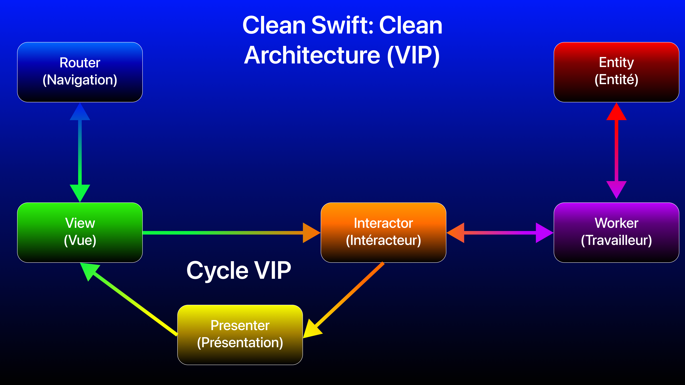
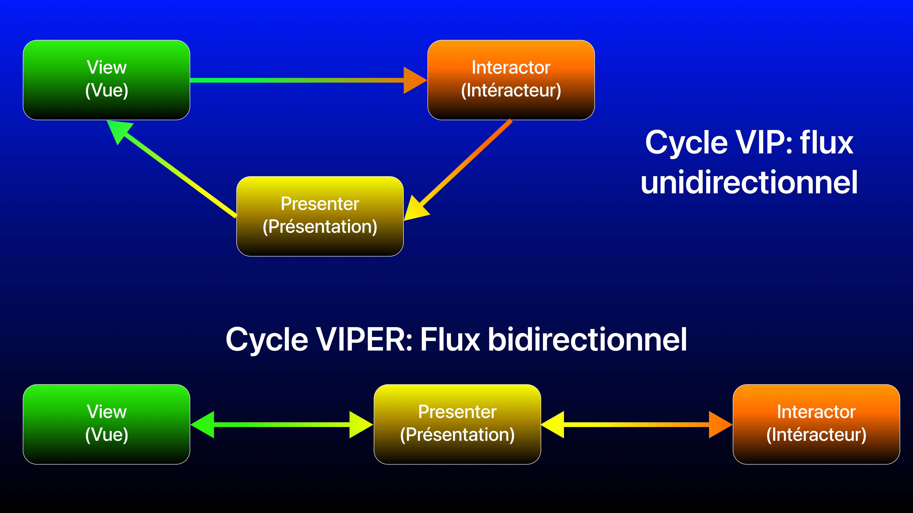

# Test technique iOS 2020 - Capgemini (Mobile Factory, DCX, Paris): Implémentation Clean Architecture (VIP) avec Clean Swift

## Introduction

Ici, voici une implémentation du test technique avec la **Clean Architecture (variante VIP avec Clean Swift)**, le tout avec **UIKit**.

## La Clean Architecture

La **Clean Architecture**, par Robert C. MARTIN (alias Uncle Bob), est un principe d'architecture permettant d'organiser et de séparer en couches les responsabilités. Ce principe est indépendant de toute technolgie et plateforme et aussi de toute architecture, en effet, on peut utiliser des architectures comme **MVVM**, **MVP**, **VIP**,... et les imbriquer dans une **Clean Architecture** en appliquant le principes des couches.

4 couches sont représentées dans le schéma ci-dessous par des cercles concentriques allant de l'extérieur vers l'intérieur, chacune ayant sa responsabilité:
- **Externe (UI ou base de données)**: La partie visuelle de l'application ou une base de données, en fonction de la plateforme et de l'application.
- **Présentation**: La partie qui reçoit les intéractions de l'utilisateur pour exécuter un use case précis (avec ou non des données en entrée) et aussi qui permet de mettre en place des données en sortie afin de notifier la couche externe de se mettre à jour avec ces nouvelles données.
- **Use case (cas d'utilisation)**: logique métier spécifique à un cas d'utilisation (appel réseau API REST, récupération de données d'une base de données pour une appli visuelle, synchronisation avec un service, ...)
- **Entités**: modèles de données définissant une logique bien précise. On appelle aussi cette couche, domaine.

Note: en fonction des plateformes et des implémentations, les couches **use case et entités** peuvent ne faire plus qu'une pour la **couche domaine**.

<br>

Grâce à cette organisation en couches, la **Clean Architecture** assure l'indépendance, garantissant un code flexible étant:
- **Indépendant des frameworks**: les frameworks et librairies tierces doivent être pensés comme des outils, et non des cadres contraignants.
- **Testable indépendamment**: les tests doivent pouvoir être réalisés sans dépendances entre les parties, et sans dépendances à des éléments externes (API, base de données, …).
- **Indépendante de l’interface utilisateur**: l’interface utilisateur doit pouvoir évoluer facilement.
- **Indépendante de la base de données.**
- **Indépendante de tout service ou système externe**: en résumé, le code doit être indépendant des tierces parties dont il n’assure pas le contrôle.

Concernant la relation entre couches, seule une couche extérieure (supérieure) peut dépendre d'une couche intérieure (inférieure), et non l'inverse. De plus chaque couche étant indépendante, la dépendance se fait par le biais d'abstraction, et non de concret. Le dernier principe du **SOLID** s'applique alors, étant l'**inversion de dépendances (D: Depency Inversion)**. Cette architecture permet de s’assurer que les changements apportés sur les couches supérieures n’aient aucun impact sur les couches inférieures, et donc de maintenir une application stable aussi bien au cours de mises à jour de ressources externes, que de tests ou d’évolutions (changement de frameworks, de base de données, etc.).

La **Clean Architecture** va donc faciliter la maintenance et la testabilité du code (adaptée pour la mise en place du **TDD: Test Driven Development**).

## Clean Swift: la variante VIP de la Clean Architecture sur iOS

En iOS avec Swift, il y a plusieurs possibilités pour implémenter une application avec une **Clean Architecture**. Les plus populaires sont celles avec une base **MVVM** et **VIP** pour les couches vue et présentation.

Ici, nous allons donc nous intéresser à l'implémentation de la variante **VIP**, étant aussi utilisé pour le modèle **Clean Swift**, très populaire dans le développement iOS.

**Clean Swift** n'est pas un framework, c'est un ensemble de template pour implémenter les composants de la **Clean Architecture** avec **VIP** (**View Interactor Presenter**). Ce concept architectural a été créé par Raymond Law en 2015.

Cette architecture particulière se compose en **scènes** représentant chacun un **use case** (cas d'utilisation). Chaque module se compose de 6 éléments:
- La **vue (View)** représente l'UI (interface graphique) et les interactions utilisateurs (appui sur un bouton, saisie de texte, ...). La vue a une relation avec l'intéracteur et le routeur. Elle représente donc ici la couche externe de la **Clean Architecture**.
- L'**intéracteur (Interactor)** représente le traitement des actions utilisateur de la vue en entrée afin d'exécuter une logique métier spécifique. En relation avec le travailleur pour récupérer des données, l'intéracteur va fournir en sortie à la présentation des données. L'intéracteur aura aussi une source de données (`Data Store`) qui une fois actualisé avec les données récupérées, permettra au routeur de faire passer une donnée d'un écran à un autre. L'intéracteur représente la couche de présentation de la **Clean Architecture** (en entrée). 
- La **présentation (Presenter)**. C'est l'intermédiaire principal entre la vue, l'intéracteur et le routeur. La présentation représente la couche de présentation de la **Clean Architecture** (en sortie). 
- L'**entité (Entity)** représente les différents modèles de données de l'application, définissant une logique bien précise. Comme le modèle en **MVC**, **MVVM** et **MVP**. Elle représente dans la **Clean Architecture** la couche des entités, de la logique métier, ou du domaine si elle est associée avec la couche **use case**, la logique d'application.
- Le **routeur (Routeur)** représente la navigation d'une vue vers une autre vue, en y faisant transiter ou non des données en entrée. Le routeur à une relation directe avec la vue mais a aussi une source de données (`Data Store`) étant une référence vers celui de l'intéracteur et utilisé s'il faut faire passer des données d'une vue à une autre. **Ce composant est optionnel, donc inutile s'il n'y pas de navigation d'un écran à un autre.**
- Le **travailleur (Worker)** représente le service qui va récupérer les données par le biais d'un appel réseau (API REST, socket,...), d'une base de données (`Core Data`, `Realm`, ...), qui sera exécuté par la logique métier de l'intéracteur (ici une requête). Une fois exécuté, l'intéracteur récupère les données (sous forme de réponse depuis les modèles). Le travailleur représente la couche **use case** ou **domain** de la **Clean Architecture**. **Ce composant est optionnel, donc inutile si la logique du use case n'a pas besoin de récupérer des données.**

**NOTE: En Clean Swift, l'entité est utilisé de 2 façons différentes:**

- De manière commune à plusieurs scènes (plusieurs use cases).
- Pour chaque use case, 3 types de modèles pour l'ensemble du flux (de l'action utilisateur à la mise à jour de la vue):
    + 1: Un modèle de requête: du `ViewController` à l'`Interactor` jusqu'au `Worker`, il s'agit d'un modèle en entrée pouvant contenir ou non des données pour exécuter une logique métier spécifique.
    + 2: Un modèle de réponse: En sortie du `Worker` (après un appel réseau, une récupération de données depuis Core Data, ...), un modèle content une donnée d'un modèle global de l'application. Ce modèle sera transmis de l'`Interactor` au `Presenter` et sera stocké aussi dans un `Data Store` de `Interactor` afin de permettre au `Router` de faire passer des données d'un écran à un autre.
    + 3: Une vue modèle: En sortie du `Presenter`, un modèle avec des données formatées prêtes à être affichées dans une vue lors d'une mise à jour.

<br>

**ATTENTION:** Pour ceux qui connaissent l'architecture **VIPER**, il ne faut surtout pas la confondre avec **VIP** qui est utilisé dans **Clean Swift**. En effet, ces 2 architectures partagent en commun les 5 éléments suivants: `View`, `Interactor`, `Presenter`, `Entity` et `Router`. Mais il y a une principale différence entre **VIPER** et **Clean Swift**, le cycle, comme ci-dessous:

<br>

En **VIPER**, la vue communique avec la présentation, la présentation communique avec le routeur (pour la navigation), l'intéracteur (pour la logique métier) et donc la vue (pour le formattage des données et la mise à jour UI). 

En **Clean Architecture VIP (Clean Swift)**, la vue communique avec le routeur (pour la navigation) et l'intéracteur pour traiter les actions utilisateur en entrée (avec ou non des données). L'intéracteur gérant la logique métier va communiquer avec un composant dédié pour les appels réseau d'une API REST, d'une base de données,... qui est un travailleur (`Worker`), en récupérant un résultat du travailleur, il va fournir en sortie à la présentation les données à formater pour la vue.

### <a name="specificity"></a>Spécificités iOS pour le Clean Swift

En partant du **MVC**, la vue et le contrôleur (`ViewController`) ne font désormais plus qu'un en **Clean Swift**, ici la vue.<br>

Comme en **MVP**, le design pattern de la délégation (`delegate`) sera beaucoup utilisé entre la vue, la présentation, le routeur et l'interacteur. Comparé au **VIPER**, il y aura 2 cycles de références à gérer:
1) Le cycle **VIP**: `ViewController` → `Interactor` → `Presenter` → `ViewController`.
2) Le cycle `ViewController` et `Router`.

Pour chaque scène, il faudra définir de 4 à 6 protocoles pour mettre en place la délégation et les références qui sont les suivantes:

**ATTENTION**: On applique l'un principe de la **Clean Architecture** (le dernier principe du **SOLID** de l'inversion de dépendances) où une entité externe dépend d'abstraction (ici d'une classe implémentant un protocole) et non d'une classe concrète. La testabilité en est donc renforcée du fait de composants indépendants entre eux. Le pattern de l'injection de dépendance est donc utilisé.

1. **De la vue à l'intéracteur**: En entrée (`ViewController` → `Interactor`), lorsque la vue s'initialise, lors des interactions utilisateur (recherche, appui sur un bouton, ...).<br>
Un protocole `BusinessLogic` où le `ViewController` aura une référence forte (`strong`) vers l'`Interactor` et qui appellera les méthodes déléguées, l'`Interactor` implémentera les méthodes du protocole `BusinessLogic`.

2. **De l'intéracteur à la présentation**: En sortie (`Interactor` → `Presenter`), lorsque l'intéracteur doit fournir en sortie des données à la présentation (ici avec un modèle de réponse).<br>
Un protocole `PresentationLogic` où l'`Interactor` aura une référence forte (`strong`) vers le `Presenter` et qui appellera les méthodes déléguées, le `Presenter` implémentera les méthodes du protocole `PresentationLogic`.

3. **De la présentation à la vue**: En sortie (`Presenter` → `ViewController`), lorsque le `Presenter` a été notifié par l'`Interactor` de nouvelles données, afin de permettre à la vue de se mettre à jour avec de nouveaux éléments.<br>
Un protocole `DisplayLogic` où le `Presenter` aura une référence faible (`weak`) vers le `ViewController` car celui-ci a déjà une référence vers l'`Interactor` qui lui même a une référence vers le `Presenter`. Le cycle **VIP** fermé s'est donc formé, il faut donc éviter la rétention de cycle entraînant une fuite de mémoire (**memory leak**) lorsque le `ViewController` sera détruit.<br>
Le `ViewController` implémentera les méthodes du protocole `DisplayLogic`. Lorsque le `Presenter` doit notifier la vue de toute mise à jour, il appellera les méthodes déléguées du `ViewController`.

4. **De la vue au routeur (logique de navigation)**: En entrée (`ViewController` → `Router`), lorsque le `ViewController` doit effectuer une navigation d'un écran à un autre, le routeur ayant une référence avec la vue va donc effectuer cette navigation.<br>
Un protocole `RoutingLogic` où le `ViewController` aura une référence forte (`strong`) vers le `Router`, et le `Router` ayant une référence faible (`weak`) vers le `ViewController`.
Le `Router` implémentera les méthodes du protocole `RoutingLogic`. Lorsque le `ViewController` doit effectuer un changement d'écran elle appellera les méthodes déléguées du `Router`.

5. **Le stockage de données (`Data Store`)**: l'`Interactor` va implémenter un protocole `DataStore` pour y stocker une variable contenant les données d'un modèle précis selon le use case. Ce protocole `DataStore` sera utilisé dans un 6ème et optionnel protocole, si le `Router` doit faire passer des données d'une vue à une autre. **Ce protocole est optionnel, donc inutile s'il n'y a pas de passage de données à effectuer.**

6. **De la vue au routeur (passage de données)**: En entrée (`ViewController` → `Router`), lorsque le `ViewController` doit effectuer une navigation d'un écran à un autre, le routeur ayant une référence avec la vue va donc effectuer cette navigation tout en y passant des données depuis un `DataStore`.<br>
Le `Router` implémentera les méthodes du protocole `DataPassing`. Par le biais des méthodes du protocole `RoutingLogic`, elle fera passer les données de manière indirecte en pointant sur le `DataStore` du `Routeur` du `ViewController` de destination. **Ce protocole est optionnel, donc inutile s'il n'y a pas de passage de données à effectuer.**

Aussi, chaque écran (`ViewController`) doit s'initialiser d'une manière très spécifique pour que toutes les références soient gérées, et notamment lorsqu'il faut faire passer des données d'un écran à un autre. Ne pas le faire dans `viewDidLoad`, mais bien dans un `init()`.

Voici la procédure à suivre:
```swift
class NewsListViewController: UIViewController {
    ...
    private var interactor: NewsListBusinessLogic?
    private var router: (NewsListRoutingLogic & NewsListDataPassing)?
    
    override init(nibName nibNameOrNil: String?, bundle nibBundleOrNil: Bundle?) {
        super.init(nibName: nibNameOrNil, bundle: nibBundleOrNil)
        setup()
    }
    
    required init?(coder aDecoder: NSCoder) {
        super.init(coder: aDecoder)
        setup()
    }
    
    override func viewDidLoad() {
        super.viewDidLoad()
        ...
    }
    
    // Mise en place des composants Clean Swift
    // self: la référence vers le ViewController.
    private func setup() {
        let interactor = NewsListInteractor(with: NewsAPINetworkService())
        let presenter = NewsListPresenter()
        let router = NewsListRouter()
        self.interactor = interactor
        self.router = router
        interactor.presenter = presenter
        presenter.view = self
        router.view = self
        router.dataStore = interactor
    }
}
```

Si les `Storyboard` sont utilisés dans un projet **iOS**, contrairement à l'architecture **VIPER**, **l'utilisation des `segue` est autorisée en Clean Swift**, étant donné que c'est au `Router` de gérer la navigation d'un écran à un autre.

### <a name="advantages"></a>Avantages et inconvénients

- Principaux avantages:
    + Architecture adaptée pour séparer la vue de la logique métier par le biais de la présentation (`Presenter`) et de l'intéracteur (`Interactor`).
    + Le premier principe du **SOLID**, principe de responsabilité unique (SRP: Single Responsibility Principle) est respecté.
    + Adapté pour les projets de grande taille pour bien séparer la
    + `ViewController` et `Presenter` allégés.
    + Grande modularité pour développer et tester indépendamment différentes parties de l'application pour permettre ensuite leur intégration.
    + Maintenabilité renforcée grâce à une séparation précise des responsabilités. La modification d'un partie de l'app en est facilitée sans affecter les autres parties (un des principes de la **Clean Architecture**), respectant ainsi le dernier principe du **SOLID**, l'inversion de dépendances (**DI: Dependency Inversion**).

- Inconvénients:
    + **Architecture très complexe**: Avec beaucoup de code qui se rajoute, la phase de développement initiale est très ralentie. Une excellente organisation et une définition très précise de chaque cas d'utilisation sera nécéssaire pour espérer aller plus vite.
    + **Maîtrise très difficile pour les juniors**, notamment du fait qu'il y a plusieurs façons de faire pour implémenter cette architecture, menant à des confusions et à des doutes. Il est préférable pour un junior de cheminer avec l'architecture **MVVM** puis **MVP** pour mieux comprendre et implémenter cette architecture.
    + **Onboarding projet difficile**, la logique de l'application en **VIPER** nécessite un temps d'adaptation beaucoup plus long pour être opérationnel, même si le développeur concerné est expérimenté.
    + Beaucoup de gestion des rétentions de cycle (bien plus qu'en **MVP**), plus complexe du fait que les liens sont bidirectionnels entre `View` et `Presenter`, `Presenter` et `Interactor`, `Presenter` et `Router`. Risque accru de **memory leak** lorsqu'un `ViewController` est détruit.
    + Compatibilité complexe avec **SwiftUI**, les vues étant de type valeur (dans des `struct`), le concept ici nécessitant des types références (donc des `class`).
    + Pour respecter à 100% les principes du **SOLID**, une vraie implémentation des principes de la **Clean Architecture** sera nécessaire (le modèle **Clean Swift** avec le cycle **VIP** est une possibilité).
