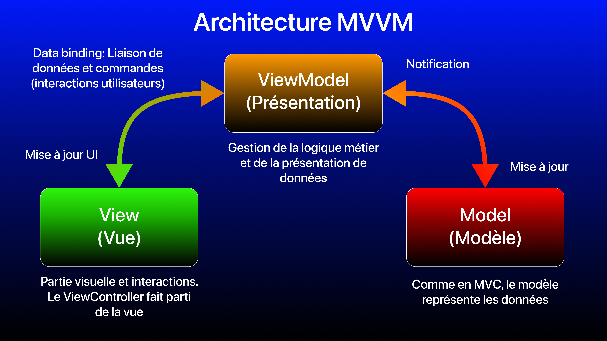

# Test technique iOS 2020 - Capgemini (Mobile Factory, DCX, Paris): Implémentation architecture MVVM

## Introduction

Ici, voici une implémentation du test technique avec l'architecture **MVVM**, le tout avec **UIKit**.

## L'architecture MVVM

L'architecture **MVVM** (**Model View ViewModel**) est un design pattern qui permet de séparer la logique métier et les interactions de l'interface utilisateur (UI). Cette architecture se compose en 3 éléments:
- Le **modèle (Model)** représente les différents modèles de données de l'application.
- La **vue (View)** représente l'UI (interface graphique) et les interactions utilisateurs (appui sur un bouton, saisie de texte, ...).
- La **vue modèle (View Model)** est l'intermédiaire entre la vue et le modèle. Ses responsabilités sont de réagir aux actions de l'utilisateur, de gérer la logique métier (ici, récupérer les données du modèle), de formater les données récupérées et mettre à jour la vue en disposant d'attributs que la vue affichera par le biais du data binding (liaison de données).

En **MVVM**, la vue ayant une référence avec la vue modèle, mais pas l'inverse (chose qui s'applique avec l'architecture **MVP**), la vue va donc s'abonner à des événements qu'émet la vue modèle.

Le data binding est un lien entre la vue et la vue modèle, où la vue par le biais des interactions avec l'utilisateur va envoyer un signal à la vue modèle afin d'effectuer une logique métier spécifique. Ce signal va donc permettre la mise à jour des données du modèle et ainsi permettre l'actualisation automatique de la vue. Le data binding en iOS peut se faire par:
- Délégation (déconseillée, plus appropriée pour l'architecture **MVP**, **VIPER**, **Clean Swift (VIP)**)
- Callbacks (closures)
- Programmation réactive fonctionnelle (**RxSwift**, **Combine**)

<br>

### <a name="specificity"></a>Spécificités iOS pour le MVVM

En partant du **MVC**, la vue et le contrôleur (`ViewController`) ne font désormais plus qu'un en **MVVM**, ici la vue.<br>

### <a name="advantages"></a>Avantages et inconvénients

- Principaux avantages:
    + Architecture adaptée pour séparer la vue de la logique métier par le biais de ViewModel
    + `ViewController` allégés.
    + Tests facilités de la logique métier (Couverture du code par les tests renforcée)
    + Adaptée avec **SwiftUI**, **MVVM** est même l'architecture de base.
    + Adaptée pour la programmation réactive (**RxSwift**, **Combine**)

- Inconvénients:
    + Les `ViewModel` deviennent massifs si la séparation des éléments ne sont pas maîtrisés, il est donc difficile de correctement découper ses structures, classes et méthodes afin de respecter le premier principe du **SOLID** étant le principe de responsabilité unique (SRP: Single Responsibility Principle). La variante **MVVM-C** qui utilise un `Coordinator` s'avère utile pour alléger les vues et gérer la navigation entre vues.
    + Potentiellement complexe pour des projets de très petite taille.
    + Inadaptée pour des projets de très grande taille (surtout si la logique métier est massive), il sera préférable de passer à l'architecture **VIPER** ou à la Clean Architecture (**VIP (Clean Swift)**, **MVVM**, ...). **MVVM** est donc intégrable dans une **Clean Architecture**.
    + Maîtrise compliquée pour les débutants avec **UIKit**, mais plus simple avec **SwiftUI**.

## Ma solution

Pour l'exemple en **MVVM**, je peux donc isoler `NewsListViewController` de la logique métier. J'utilise donc le concept clé du **MVVM** qui est `NewsViewModel` qui va contenir toute cette logique métier. `RxSwift` étant extrêmement populaire avec l'architecture **MVVM**, on y effectuera donc le data binding du `ViewModel` vers le `ViewController`, avec un `PublishSubject` où on y émettra par le biais d'un flux asynchrone les données pour mettre à jour la vue, `NewsViewModel` contiendra donc les émétteurs d'événements.

De plus, le `ViewModel` permettant ainsi de mieux tester la logique métier, j'utiliserai donc ici une injection de dépendance pour la récupération de données, avec une abstraction. Si j'effectue des tests unitaires avec `XCTest`, je fournirai donc un mock pour simuler les appels API, sinon dans l'appli je fournis une instance gérant les appels réseau.

```swift
final class NewsListViewModel {
    /* Partie RxSwift:
     - PublishSubject: un sujet (Subject) faisant office d'émetteur (Observer) et de récepteur (Observable, abonné). Avec .onNext(), on émet une valeur. Particularité de ce type de sujet: démarre sans valeur et émet seulement des nouveaux éléments aux abonnés.
    -> La partie qui va s'abonner au sujet recevra la valeur avec .subscribe(onNext: { value in })
    */
    let articles = PublishSubject<[ArticleViewModel]>()
    let error = PublishSubject<NewsAPIError>()
    
    private let apiService: NewsAPIService?
    
    // Grâce à une injection de dépendance par le biais d'un type abstrait, la testabilité sera assurée si on utilise un mock pour simuler les appels d'API REST.
    init(apiService: NewsAPIService) {
        self.apiService = apiService
    }
    
    func fetchNews() {
        print("Call depuis le viewModel")
        apiService?.fetchNews { [weak self] result in
            self?.handleResult(with: result)
        }
    }
    
    func searchNews(with query: String) {
        print("Call search depuis le viewModel")
        apiService?.searchNews(query: query) { [weak self] result in
            self?.handleResult(with: result)
        }
    }
    
    private func handleResult(with result: Result<ArticleOutput, NewsAPIError>) {
        switch result {
            case .success(let output):
                print("\(output.totalResults ?? 0) articles")
                
                guard let data = output.articles else {
                    print("ERREUR")
                    self.error.onNext(.decodeError)
                    return
                }
                
                articles.onNext(parseViewModels(with: data))
                
            case .failure(let error):
                self.error.onNext(error)
        }
    }
    
    private func parseViewModels(with articles: [Article]) -> [ArticleViewModel] {
        var viewModels = [ArticleViewModel]()
        articles.forEach { viewModels.append(ArticleViewModel(article: $0)) }
        
        return viewModels
    }
}
```

Les `PublishSubject` étant utilisé dans `NewsViewModel`, `NewsViewController` va donc s'abonner à ces événements. On y définit donc les liens afin d'y effectuer le `data binding` entre `NewsViewModel` et `NewsViewController`.
Utilisant aussi `RxCocoa`, l'extension `rx` pour le `TableView` et la `SearchBar` permet ainsi l'actualisation automatique et asynchrone (on se dispense ainsi de `DispatchQueue.main.async`). Pour les abonnements des flux, on utilise `.observe(on: MainScheduler.instance).subscribe(onNext: { value in }`. Tout cela y est géré dans une méthode `setBindings()`.

```swift
final class NewsListViewController: UIViewController {

    @IBOutlet weak var searchBar: UISearchBar!
    @IBOutlet weak var tableView: UITableView!
    
    /* Partie RxSwift
    - DisposeBag: Utilisé pour éviter les memory leaks, elle stocke les Disposables de chaque abonnement. Cela facilite la gestion des abonnements
    */
    private let disposeBag = DisposeBag()
    private let viewModel = NewsListViewModel(apiService: NewsAPINetworkService())
    
    override func viewDidLoad() {
        super.viewDidLoad()
        setBindings()
        viewModel.fetchNews()
    }
    
    // Data binding de l'architecture MVVM avec RxSwift, les abonnements
    private func setBindings() {
        // Recherche réactive
        searchBar.rx.text
            .debounce(.milliseconds(800), scheduler: MainScheduler.instance)
            .compactMap { $0 }
            .filter { !$0.isEmpty }
            .subscribe { [weak self] query in
                self?.viewModel.searchNews(with: query)
            }
            .disposed(by: disposeBag)
        
        searchBar.rx.searchButtonClicked
            .asDriver(onErrorJustReturn: ())
            .drive(onNext: { [weak self] _ in
                self?.searchBar.resignFirstResponder()
            })
            .disposed(by: disposeBag)
        
        // Les cellules une fois les données récupérées. L'actualisation est automatique et asynchrone. La liste d'article est liée à la TableView.
        viewModel.articles.bind(to: tableView.rx.items(cellIdentifier: "newsCell", cellType: NewsListTableViewCell.self)) { (row, element, cell) in
            cell.configure(with: element)
        }
        .disposed(by: disposeBag)
        
        // La sélection d'un cellule d'un TableView
        tableView.rx.modelSelected(ArticleViewModel.self)
            .subscribe { [weak self] articleViewModel in
                self?.openDetailView(with: articleViewModel)
            }
            .disposed(by: disposeBag)
        
        // Affichage des erreurs
        viewModel.error
            .observe(on: MainScheduler.instance)
            .subscribe(onNext: { [weak self] error in
                let alert = UIAlertController(title: "Erreur", message: error.rawValue, preferredStyle: .alert)

                alert.addAction(UIAlertAction(title: "OK", style: .default, handler: { _ in
                     print("OK")
                }))

                self?.present(alert, animated: true, completion: nil)
            })
            .disposed(by: disposeBag)
    }
}
```

Pour terminer, le `ViewModel` peut aussi avoir comme simple responsabilité d'avoir des données formatées prêtes à afficher par la vue, c'est donc ici ce je mets en place avec `ArticleViewModel`. Je m'assure donc ainsi que `NewsListViewController` n'ait aucune connaissance du modèle, ici `Article`. `ArticleViewModel` pourra être utilisé dans chaque `TableViewCell` du `TableView`, mais aussi dans la vue détail.

```swift
struct ArticleViewModel {
    let source: String
    let author: String
    let title: String
    let description: String
    let urlToImage: String
    let publishedAt: String
    let content: String
    
    // Injection de dépendance
    init(article: Article) {
        self.source = article.source?.name ?? "Source inconnue"
        self.author = article.author ?? "Auteur inconnu"
        self.title = article.title ?? "Titre indisponible"
        self.description = article.description ?? "Aucune description"
        self.urlToImage = article.urlToImage ?? ""
        self.publishedAt = article.publishedAt ?? "Date inconnue"
        self.content = article.content ?? "Contenu indisponible"
    }
}
```

Pour la suite du cheminement vers les autres architectures **MVP**, **VIPER**, ce type de `ViewModel` sera réutilisé. Pour améliorer cette base en **MVVM**, il sera alors possible d'isoler la navigation avec le pattern de la coordination (`Coordinator`), ce qui donnera donnera donc la variante **MVVM-C**. Mais aussi d'imbriquer cette base **MVVM** dans une **Clean Architecture**, au quel cas d'utiliser les design patterns appropriés pour bien gérer la séparation des responsabilités en couches, l'indépendance et améliorer davantage la testabilté.

Concernant l'architecture **MVP**, c'est assez similaire à **MVVM**, sauf que la principale différence est que le `Presenter` (étant l'équivalent du `ViewModel`) aura aussi une référence avec le `ViewController`, et donc une référence circulaire. La mise à jour de la vue ne se fera pas par le `data binding`, mais par le pattern de la délégation `delegate`.