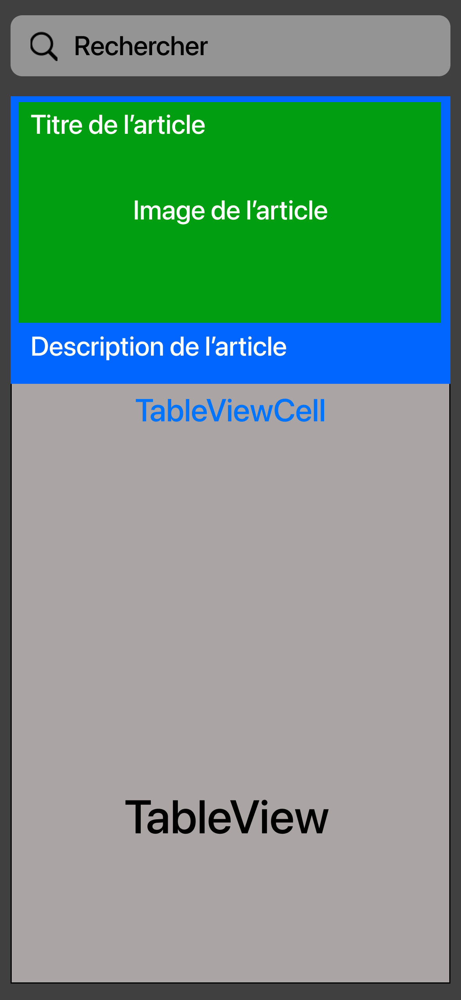
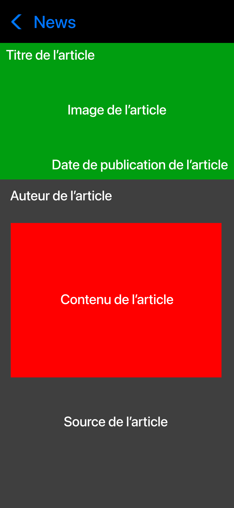
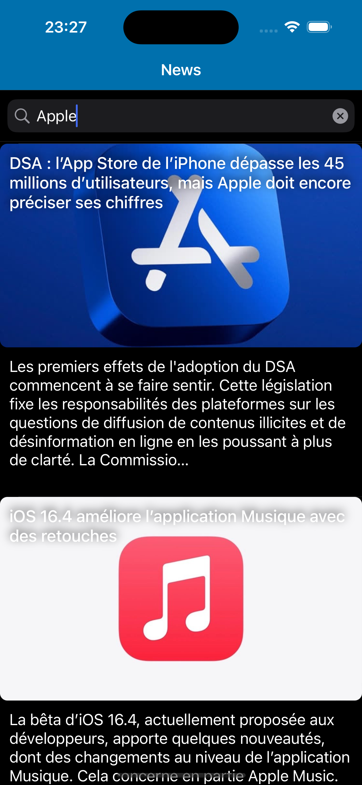

# Test technique iOS 2020 - Capgemini (Mobile Factory, DCX, Paris)

## Plan de navigation

- [Introduction](#introduction)
- [Sujet](#subject)
- [Ma solution](#mysolution)
    + [Architecture MVC]()
    + [Architecture MVVM]()
    + [Architecture MVP]()
    + [Architecture VIPER]()
    + [Clean Architecture (VIP): Clean Swift]()
    

## <a name="introduction"></a>Introduction

Ici un test technique que j'ai réalisé lors de mon stage de fin d'études en 2020, au sein de Capgemini, à Paris, plus précisément à Issy-les-Moulineaux. 

En interne, au sein de la Mobile Factory de la Business Unit DCX (Digital Customer eXperience) Paris, lors de mon upskilling iOS, cet exercice ci-dessous m'a été proposé par l'un des leads iOS internes.

En 2020, pendant le COVID en plein confinement, durant mon stage, je n'étais pas au top de mes capacités, j'étais vraiment en position de pur débutant d'iOS ayant enfin eu l'opportunité de travailler avec un Mac ayant suffisamment de capacité (surtout la RAM avec 16 GB) pour faire du développement iOS avec Xcode. Moralement, je n'étais pas bien aussi. C'est aussi là que je commence à peine à me sensibiliser aux différentes architectures, mais je ne savais clairement pas comment m'y prendre pour les implémenter. 

Je n'avais fait ce test qu'avec l'architecture **MVC** à l'époque. L'architecture la plus appréciée par le lead à cette époque en 2020: **Clean Swift**, c'est-à-dire une **Clean Architecture** avec le cycle **VIP**.

Pour information, c'est aussi de ce test technique que j'ai eu l'inspiration de mon projet personnel qu'est [SuperNews](https://github.com/Kous92/SuperNews-iOS-Swift5).

Aujourd'hui en 2023, avec le recul et tout ce que j'ai appris, je vous montre maintenant mes différentes implémentations avec les architectures qu'on utilise en iOS, ici **MVC**, **MVVM**, **MVP** et **Clean (ici Clean Swift)**. Le tout avec une analyse qui prend en compte des principes du **software craftsmanship**: **SOLID**, principes de Clean Code (**KISS**, **DRY**, **YAGNI**, ...)

J'invite tout développeur iOS junior et débutant à s'exercer en effectuant ce test. Pour les implémentations d'architectures, je vous recommande de cheminer comme ceci:
1) MVC
2) MVVM
3) MVP
4) VIPER
5) Clean Swift (VIP)

Voici le sujet ci-dessous.

## <a name="subject"></a>Sujet

Développer une application qui consomme l’API News en affichant les articles dans une `tableView`. Au clic sur un article, l’article est affiché (`push`) dans un nouvel écran (voir maquettes ci-dessous).

### API à utiliser: NewsAPI

- Endpoint de l'API: https://newsapi.org/v2/top-headlines?country=fr&apiKey=API_KEY
- Clé d'API: à récupérer sur https://newsapi.org en y créeant un compte.
- Documentation: https://newsapi.org/docs

### Obligatoire

- Vue principale
- Architecture (MVC, MVP, MVVM, VIPER, Clean)
- Langage: Swift
- Appel REST avec Alamofire (intégration avec **CocoaPods**)
- Téléchargement asynchrone des images
- Utilisation d’un ou plusieurs `Storyboard` (`AutoLayout`)

### Facultatif

- Vue détail
- RxSwift
- Tests unitaires
- Search bar pour chercher en fonction des titres
- Layout Anchors
- Parsing avec Swift (ici `Decodable`)

### Maquettes

Vue principale (obligatoire) et vue détail (facultative)

 

## <a name="mysolution"></a>Ma solution (au niveau commun)

**Ici, les éléments communs à toutes les implémentations d'architectures.**

Dans ce test, la première chose qu'on doit prendre en compte est le fait qu'il faut obligatoirement utiliser le `Storyboard`. Ce qui implique qu'on travaille donc avec **UIKit**, on ne peut donc pas utiliser **SwiftUI**. Pour le nombre de `Storyboard` à utiliser, un seul suffira vu qu'il n'y a que 2 écrans. Bien évidemment, on travaillera avec le langage **Swift**, **Objective-C** étant archaïque aujourd'hui.

Ensuite, côté réseau, on doit obligatoirement utiliser le package tiers `Alamofire` et aussi utiliser **CocoaPods** pour l'installation du package (**Swift Package Manager** aurait été meilleur et plus simple pour la gestion des packages).

Pour le téléchargement asynchrone d'images, il est recommandé et même nécessaire d'utiliser un cache. De mon côté, j'ai choisi d'utiliser le package tiers `Kingfisher` qui permet à la fois un téléchargement asynchrone de l'image, le tout avec une gestion de cache intégrée.

Pour le modèle des données des articles qu'on récupèrera de l'API REST avec `Alamofire`, le protocole `Decodable` sera utilisé pour le parsing du **JSON** en objets **Swift**. Chaque nom d'attribut et type doit obligatoirement matcher avec sa version **JSON** pour que le décodage aboutisse.

**NOTE**: Si on utilise `Codable`, on violerait le 4ème principe du **SOLID** (**I: Interface Segregation**) étant la ségrégation d'interface où un objet ne doit jamais être forcée à installer une interface qu’il n’utilise pas et les objets ne doivent pas être forcés à dépendre de méthodes qu’ils n’utilisent pas. `Codable` représente `Encodable` et `Decodable`

Voici ci-dessous les définitions de modèles d'articles prêts à être décodés pour les différentes vues.
```swift
import Foundation

// MARK: - Response
struct ArticleOutput: Decodable {
    let status: String?
    let totalResults: Int?
    let articles: [Article]?
}

// MARK: - Article
struct Article: Decodable {
    let source: Source?
    let author: String?
    let title: String?
    let description: String?
    let urlToImage: String?
    let publishedAt: String?
    let content: String?
}

// MARK: - Source
struct Source: Decodable {
    let name: String?
}
```

### Appel API REST avec `Alamofire`

Concernant l'appel de l'API REST NewsAPI, afin d'être bien structuré, 3 éléments seront nécessaires. 

1) Un découpage des endpoints. En effet, l'appli a 2 possibilités de récupérer des articles, soit à l'initialisation, soit lors d'une recherche. Cette énumération va donc construire l'URL lors de l'appel réseau. Et cela nous aidera bien pour appliquer le principe **DRY**.
```swift
enum NewsAPIEndpoint {
    case initNews(country: String)
    case searchNews(language: String, query: String)
    
    var baseURL: String {
        return "https://newsapi.org/v2/"
    }
    
    var path: String {
        switch self {
        case .initNews(let country):
            return "top-headlines?country=\(country)"
        case .searchNews(let language, let query):
            return "everything?language=\(language)&q=\(query)&sortBy=publishedAt"
        }
    }
}
```

2) Une énumération pour définir les différentes erreurs possibles lors de appel réseau.
```swift
enum NewsAPIError: String, Error {
    case parametersMissing = "Erreur 400: Paramètres manquants dans la requête."
    case invalidApiKey = "Erreur 401: La clé d'API fournie est invalide ou inexistante."
    case notFound = "Erreur 404: Aucun contenu disponible."
    case tooManyRequests = "Erreur 429: Trop de requêtes ont été effectuées dans un laps de temps. Veuillez réessayer ultérieurement."
    case serverError = "Erreur 500: Erreur serveur."
    case apiError = "Une erreur est survenue."
    case invalidURL = "Erreur: URL invalide."
    case networkError = "Une erreur est survenue, pas de connexion Internet."
    case decodeError = "Une erreur est survenue au décodage des données téléchargées."
    case downloadError = "Une erreur est survenue au téléchargement des données."
    case unknown = "Erreur inconnue."
}
```

3) Avec les énumérations définies, voici la classe `NewsAPIService` qui se chargera d'effectuer les appels réseau. `AF.request(url).validate().responseDecodable(of: T.self)` est la méthode d'`Alamofire` qui effectuera la requête HTTP, qui s'assurera que le code 200 est retourné et qui retournera une réponse sous forme d'objets Swift décodés. Dans sa closure, on gèrera tous les cas d'erreur ou lorsque c'est réussi par le biais de `Result<T, NewsAPIError>`. On notera aussi qu'un type générique `T` est utilisé afin d'avoir un code de requête HTTP `GET` réutilisable en fonction de l'URL et du type de données décodées à retourner.

```swift
import Foundation
import Alamofire

final class NewsAPIService {
    private var apiKey: String = "API_KEY" // C'est ici que vous placerez votre clé d'API
    
    func fetchNews(completion: @escaping (Result<ArticleOutput, NewsAPIError>) -> ()) {
        getRequest(endpoint: .initNews(country: "fr"), completion: completion)
    }
    
    func searchNews(query: String, completion: @escaping (Result<ArticleOutput, NewsAPIError>) -> ()) {
        getRequest(endpoint: .searchNews(language: "fr", query: query.addingPercentEncoding(withAllowedCharacters: .afURLQueryAllowed) ?? ""), completion: completion)
    }
    
    private func getRequest<T: Decodable>(endpoint: NewsAPIEndpoint, completion: @escaping (Result<T, NewsAPIError>) -> ()) {
        guard let url = URL(string: endpoint.baseURL + endpoint.path + "&sortBy=publishedAt&apiKey=\(apiKey)") else {
            completion(.failure(.invalidURL))
            return
        }
        
        print("URL appelée: \(url.absoluteString)")
        
        AF.request(url).validate().responseDecodable(of: T.self) { response in
            switch response.result {
            case .success:
                guard let data = response.value else {
                    completion(.failure(.downloadError))
                    return
                }
                
                completion(.success(data))
            case let .failure(error):
                guard let httpResponse = response.response else {
                    print("ERREUR: \(error)")
                    completion(.failure(.networkError))
                    return
                }
                
                switch httpResponse.statusCode {
                case 400:
                    completion(.failure(.parametersMissing))
                case 401:
                    completion(.failure(.invalidApiKey))
                case 404:
                    completion(.failure(.notFound))
                case 429:
                    completion(.failure(.tooManyRequests))
                case 500:
                    completion(.failure(.serverError))
                default:
                    completion(.failure(.unknown))
                }
            }
        }
    }
}
```

### La vue principale: `NewsListViewController`

Très simple à concevoir, on va y placer 3 composants au minimum:
- `TableView`
- `SearchBar`
- `UITableViewCell`: 2 `UILabel` et 1 `UIImageView`.

**ATTENTION:** Bien s'assurer depuis le `Storyboard` et le code de `NewsListViewController` que `SearchBar` n'ait aucune référence avec `delegate`, de même pour `TableView` qui ne doit avoir aucune référence avec `delegate` et `dataSource` étant donné qu'on utilisera l'extension `rx`, cela causerait un crash.

Le challenge ici pour un débutant sera de faire de bien disposer les éléments sur le `ViewController` avec l'**Auto Layout**.

Étant donné qu'il est intéressant dans ce test d'utiliser la célèbre librairie `RxSwift`, pour la programmation réactive fonctionnelle, `RxSwift` sera donc utilisé en combinaison avec `RxCocoa` pour rendre réactifs le `TableView` et le `SearchBar`. Il est clair que `Combine` est préférable car directement écrit par Apple.<br>
Avec la programmation réactive fonctionnelle, on pourra donc se dispenser de `DispatchQueue.main.async`, mais aussi d'implémenter les méthodes des protocoles `UITableViewDelegate`, `UITableViewDataSource` et `UISearchBarDelegate`. L'architecture la plus adaptée avec `RxSwift` est sans aucun doute **MVVM**.

`NewsListViewController` sera lui même imbriqué dans un `NavigationController` pour la vue détail au tap sur l'une des cellules de la liste des articles étant donné qu'il est demandé de faire une transition `push`.

**Voici le résultat final de la vue principale:**



### La vue détail: `NewsDetailViewController`

Ici, simplement à mettre les `UILabel` pour les différents éléments demandés avec l'`UIImageView`. 

Depuis la vue principale, on fait passer les données de l'article associé à la cellule et la vue détail les affiche dans les différents labels. 

Pour la date de publication, il faut faire une opération de conversion pour passer du format `yyyy-MM-dd'T'HH:mm:ss+0000Z` au format `dd/MM/yyyy à HH:mm`, comme ci-dessous, avec une méthode réutilisable je vais donc créer une méthode réutilisable dans une extension de `String`. Et le texte qui affichera la date de publication utilisera cette méthode `stringToDateFormat()`

```swift
import Foundation

extension String {
    // Conversion de la chaîne de date au format "yyyy-MM-dd'T'HH:mm:ss+0000Z" au format "dd/MM/yyyy à HH:mm"
    func stringToDateFormat() -> String {
        let formatter = DateFormatter()
        formatter.locale = Locale(identifier: "en_US_POSIX")
        formatter.dateFormat = "yyyy-MM-dd'T'HH:mm:ssZ"

        guard let date = formatter.date(from: self) else {
            return "Date de publication inconnue"
        }
        
        formatter.locale = Locale(identifier: "fr_FR")
        formatter.dateStyle = .short
        
        let dateString = formatter.string(from: date) // Jour, mois, année
        
        formatter.dateStyle = .none
        formatter.timeStyle = .short
        
        let timeString = formatter.string(from: date) // Heure, minutes
        
        return "Le " + dateString + " à " + timeString
    }
}
```

**Voici le résultat final de la vue détail:**


### Téléchargement asynchrone de l'image

Dans la vue détail et dans chaque cellule de la vue principale, afin d'éviter des répétitions de code (principe **DRY** respecté), je vais donc créer une méthode réutilisable dans une extension de `UIImageView`. C'est ici que le téléchargement asynchrone de l'image et la gestion du cache est automatique. Une fois le téléchargement se fait pour la cellule, la seconde fois depuis le cache (notamment dans la vue détail). 

Aussi, pour les cellules du `TableView`, il faut mettre aussi en place une annulation de tâche de téléchargement lorsqu'on scroll vite pour optimiser les performances de l'app. À utiliser dans la méthode `prepareForReuse` de `NewsListTableViewCell`.

```swift
import Foundation
import UIKit
import Kingfisher

extension UIImageView {
    // Téléchargement asynchrone de l'image
    // Avec Kingfisher, c'est asynchrone, rapide et efficace. Le cache est géré automatiquement.
    func loadImage(with url: String) {
        let defaultImage = UIImage(systemName: "swift")
        
        guard !url.isEmpty, let imageURL = URL(string: url) else {
            // URL de l'image indisponible
            self.image = defaultImage
            return
        }
        
        let resource = ImageResource(downloadURL: imageURL)
        self.kf.indicatorType = .activity // Indicateur pendant le téléchargement
        self.kf.setImage(with: resource, placeholder: defaultImage, options: [.transition(.fade(0.5))])
    }

    // Indispenable pour optimiser les performances lors du scroll d'un TableView
    func cancelDownloadTask() {
        self.kf.cancelDownloadTask()
        self.image = nil
    }
}
```