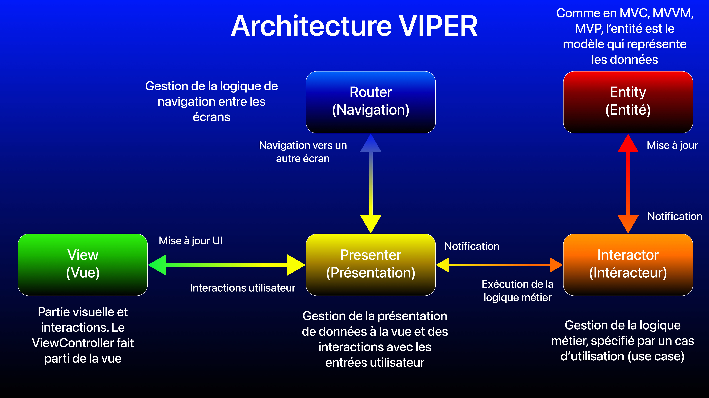

# Test technique iOS 2020 - Capgemini (Mobile Factory, DCX, Paris): Implémentation architecture VIPER

## Introduction

Ici, voici une implémentation du test technique avec l'architecture **VIPER**, le tout avec **UIKit**.

## L'architecture VIPER

L'architecture **VIPER** (**View Interactor Presenter Entity Router**) est un design pattern qui permet de séparer la logique métier et les interactions de l'interface utilisateur (UI). Cette architecture est née des principes de la **Clean Architecture d'Uncle Bob**.

Cette architecture se compose en **modules** représentant chacun un **use case** (cas d'utilisation précis). Chaque module se compose de 5 éléments:
- La **vue (View)** représente l'UI (interface graphique) et les interactions utilisateurs (appui sur un bouton, saisie de texte, ...).
- L'**intéracteur (Interactor)** représente la gestion de la logique métier (ici, récupérer les données du modèle, que ce soit par un appel réseau, depuis une base de données, ....).
- La **présentation (Presenter)**. C'est l'intermédiaire principal entre la vue, l'intéracteur et le routeur. Ses responsabilités sont de réagir aux actions de l'utilisateur, de formater les données récupérées et mettre à jour la vue en disposant d'attributs que la vue affichera par le biais d'une vue modèle, et notifie le routeur d'une navigation d'un écran à un autre (avec ou non des données à passer).
- L'**entité (Entity)** représente les différents modèles de données de l'application. Comme le modèle en **MVC**, **MVVM** et **MVP**.
- Le **routeur (Routeur)** représente la gestion de la navigation entre plusieurs écrans.

**NOTE: L'entité est souvent commune à plusieurs modules VIPER dans l'application. Il n'est pas nécessaire d'implémenter des modèles de données spécifiques s'il n'y en a pas besoin.** 

 

### Spécificités iOS pour le VIPER

En partant du **MVC**, la vue et le contrôleur (`ViewController`) ne font désormais plus qu'un en **VIPER**, ici la vue. 

Comme en **MVP**, le design pattern de la délégation (`delegate`) sera beaucoup utilisé entre la vue, la présentation, le routeur et l'interacteur. Il y aura donc plusieurs cycles de références à gérer. 

Pour chaque module, il faudra définir 5 protocoles pour mettre en place la délégation qui sont les suivants:

**ATTENTION**: On applique un principe de la **Clean Architecture** (le dernier principe du **SOLID** de l'inversion de dépendances) où une entité externe dépend d'abstraction (ici d'une classe implémentant un protocole) et non d'une classe concrète. La testabilité en est donc renforcée du fait de composants indépendants entre eux. Le pattern de l'injection de dépendance est donc utilisé.

1. **De la vue à la présentation**: En entrée (`ViewController` → `Presenter`), lorsque la vue s'initialise, lors des interactions utilisateur (recherche, appui sur un bouton, ...). 
Un protocole `PresenterDelegate` où le `ViewController` aura une référence forte (`strong`) vers le `Presenter`, le `Presenter` implémentera les méthodes du protocole `PresenterDelegate`. Lors des différentes interactions utilisateur, le `ViewController` appellera les méthodes déléguées du `Presenter`. 

2. **De la présentation à la vue**: En sortie (`Presenter` → `ViewController`), lorsque le `Presenter` a été notifié par l'`Interactor` de nouvelles données, afin de permettre à la vue de se mettre à jour avec de nouveaux éléments. 
Un protocole `ViewDelegate` où le `Presenter` aura une référence faible (`weak`) vers le `ViewController` car celui-ci a déjà une référence vers le `Presenter`, il faut donc éviter la rétention de cycle entraînant une fuite de mémoire (**memory leak**) lorsque le `ViewController` sera détruit. 
Le `ViewController` implémentera les méthodes du protocole `ViewDelegate`. Lorsque le `Presenter` doit notifier la vue de toute mise à jour, appellera les méthodes déléguées du `ViewController`.

3. **De la présentation à l'intéracteur**: En entrée (`Presenter` → `Interactor`), lorsque le `Presenter` a été notifié par le `ViewController`, le `Presenter` va appeler l'`Interactor` pour que celui exécute une logique métier spécifique (appel d'une **API REST**, récupération de données depuis `Core Data`, ...). 
Un protocole `InteractorInputDelegate` où le `Presenter` aura une référence forte (`strong`) vers l'`Interactor`, l'`Interactor` implémentera les méthodes du protocole `PresenterDelegate`. Lorsque l'`Interactor` doit notifier le `Presenter` que sa tâche est terminée et qu'il a des données à transmettre, appellera les méthodes déléguées du `ViewController`.

4. **De l'intéracteur à la présentation**: En sortie (`Interactor` → `Presenter`), lorsque le `Presenter` a été notifié par le `ViewController`, le `Presenter` va appeler l'`Interactor` pour que celui exécute une logique métier spécifique (appel d'une **API REST**, récupération de données depuis `Core Data`, ...). 
Un protocole `InteractorOutputDelegate` où le `Interactor` aura une référence faible (`weak`) vers le `Presenter`, l'`Interactor` implémentera les méthodes du protocole `PresenterDelegate`. Lorsque l'`Interactor` doit notifier le `Presenter` que sa tâche est terminée et qu'il a des données à transmettre, appellera les méthodes déléguées du `ViewController`.

5. **De la présentation au routeur**: En entrée (`Presenter` → `Router`), lorsque le `Presenter` a été notifié par le `ViewController`, le `Presenter` va appeler l'`Interactor` pour que celui exécute une logique métier spécifique (appel d'une **API REST**, récupération de données depuis `Core Data`, ...). 
Un protocole `InteractorOutputDelegate` où le `Interactor` aura une référence faible (`weak`) vers le `Presenter`, l'`Interactor` implémentera les méthodes du protocole `PresenterDelegate`. Lorsque l'`Interactor` doit notifier le `Presenter` que sa tâche est terminée et qu'il a des données à transmettre, appellera les méthodes déléguées du `ViewController`.

Si les `Storyboard` sont utilisés dans un projet **iOS** avec l'architecture **VIPER**, **l'utilisation des `segue` est interdite**, étant donné que c'est au `Router` de gérer la navigation d'un écran à un autre.

### Avantages et inconvénients

- Principaux avantages:
    + Architecture adaptée pour séparer la vue de la logique métier par le biais de la présentation (`Presenter`) et de l'intéracteur (`Interactor`).
    + Le premier principe du **SOLID**, principe de responsabilité unique (**SRP: Single Responsibility Principle**) peut être respecté.
    + Adapté pour les projets de grande taille pour bien séparer la
    + `ViewController` et `Presenter` allégés.
    + Grande modularité pour développer et tester indépendamment différentes parties de l'application pour permettre ensuite leur intégration.
    + Maintenabilité renforcée grâce à une séparation précise des responsabilités. La modification d'une partie de l'app en est facilitée sans affecter les autres parties (un des principes de la **Clean Architecture**), respectant ainsi le dernier principe du **SOLID**, l'inversion de dépendances (**DI: Dependency Inversion**).

- Inconvénients:
    + **Architecture très complexe**: Avec beaucoup de code qui se rajoute, la phase de développement initiale est très ralentie. Une excellente organisation et une définition très précise de chaque cas d'utilisation sera nécéssaire pour espérer aller plus vite.
    + **Maîtrise difficile pour les juniors**, notamment du fait qu'il y a plusieurs façons de faire pour implémenter cette architecture, menant à des confusions et à des doutes. Il est préférable pour un junior de cheminer avec l'architecture **MVVM** puis **MVP** pour mieux comprendre et implémenter cette architecture.
    + **Onboarding projet difficile**, la logique de l'application en **VIPER** nécessite un temps d'adaptation beaucoup plus long pour être opérationnel, même si le développeur concerné est expérimenté. Il peut être très facile de s'y perdre si l'application est gigantesque.
    + **Beaucoup de gestion des rétentions de cycle (bien plus qu'en **MVP**)**, plus complexe du fait que les liens sont bidirectionnels entre `View` et `Presenter`, `Presenter` et `Interactor`, `Presenter` et `Router`. Risque accru de **memory leak** lorsqu'un `ViewController` est détruit.
    + Compatibilité complexe avec **SwiftUI**, les vues étant de type valeur (dans des `struct`), le concept ici nécessitant des types références (donc des `class`).
    + Pour respecter à 100% les principes du **SOLID**, une vraie implémentation des principes de la **Clean Architecture** sera nécessaire (le modèle **Clean Swift** avec le cycle **VIP** est une possibilité).
